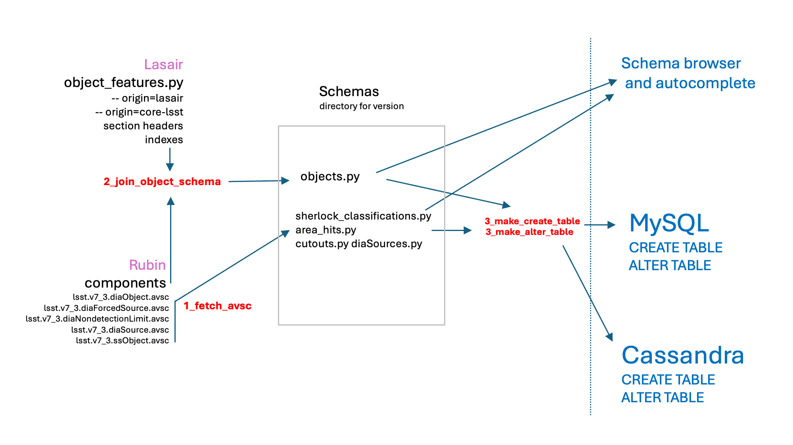

## Lasair Schema handling



New plan for schema wrangling, which should take out a lot of the manual intervention that we have now whenever the Rubin schema gets updated. In the diagram, there is a flow from left to right. 

Top-left is the Lasair `object_features` schema, listing the Lasair-specific light-curve and other features, with docstrings, together with the section headers for presentation, and the index to be used for the MySQL `objects` table.

Lower left is the five AVSC files from the [Rubin schema](https://github.com/lsst/alert_packet/tree/main/python/lsst/alert/packet/schema/7/3). These are liable to be changed without our control. They are named as for example 7.4 or 704 which mean the same thing.

The box in the centre of the diagram is a versioned collection of all the Lasair schemas. In addition to `objects.py`, there are MySQL schemas for `sherlock_classifications`, `area_hits`, and others, and there are CQL schemas for `diaObjects`, `diaSources`, `cutouts`,  etc.

The box in the diagram indicates that these files are versioned.
We are using a naming scheme like 7_4 or 7_4_a, where the first two 
parts of the name -- 7 and 4 -- are used to refer to the associated Rubin schema, 
and the last part of the name is a possible new version of the schema 
tables from Lasair, for example adding a new lightcurve feature at the top-left.

Indexing information is held in three places: for the Rubin components the index is stored in and added by the `1_fetch_avsc` program; for the Lasair `objects` table it is in the `object_features` table top-left; and for other tables it is kept in the versioned schema files.

These data files are transformed by three programs:

- `1_fetch_avsc`: pulls the AVSC files from github, and makes some cosmetic changes. Also changes dec to decl and adds the indexes needed to store these in Cassandra.

- `2_join_object_schema`: combines Lasair `object_features` and the Rubin `diaObject` above and builds the `objects.py` in the relevant schema directory.

- `3_make_create_table`: converts the table specifications to SQL or CQL CREATE TABLE commands, or

- `3_make_alter_table`: compares the table specifications of two different schema instantiations and uses the difference to make SQL or CQL ALTER TABLE commands.

There is also a `3_make_all_alter_table` which runs `3_make_alter_table` for all the tables.

### Updating the schema

- `cd lasair-lsst/common/schema`
- Copy the old to the new schema:
```
cp -R 7_3 7_4
```
- Fetch and replace all the Rubin .avsc files:
```
python3 1_fetch_avsc.py 7_4
```
- Build the combined `objects.py` for MySQL:
```
    python3 2_join_object_schema.py 7_4
```
- Generate required `ALTER TABLE` commands:
```
python3 3_make_all_alter_table.py 7_3 7_4
```
