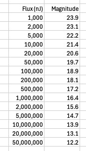
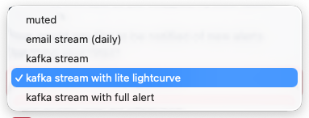

# Lasair Concepts
## Objects and Sources

Lasair deals in *objects* and *sources*. A source is a detection by the telescope of an object.  A source is a collection of pixels on the telescopes light-collection device, which is significantly brighter (five sigma) than it was in the reference imagery, that was taken at the beginning of the survey.  A source is detected with a specific [narrowband optical filter](https://en.wikipedia.org/wiki/Photometric_system):
LSST uses filters u,g,r,i,z,y. The wavelengths of these are
0.380,     0.500,     0.620,     0.740,     0.880,     1.000 microns, respectively.

When a lot of sources are found in the same place in the sky (i.e. within 1.5 arcsec), the collection is called an object.  Thus an object is a star or similar that *does not move* in the sky.  Usually it is assumed that an object corresponds to a real astrophysical object, such as star or something extragalactic.

Sometimes the aggregation process of coincident sources to an object does not work perfectly,
and there may be multiple objects in the Lasair database that are really all the same astrophysical object.
There is a button on Lasair's object page labelled **Coincident diaObjects** that can find such 
extra objects that really should be collected together as one.

The brightness of a source in a transient survey is actually a *difference* brightness.
If an object is a variable star, then its optical flux was measured before the survey -- 
a reference flux -- and the source detection is the difference, positive or negative, from this.
Unfortunately, the trust magnitude scale that astronomers has used for 2,000 years is 
unsuitable for difference flux; it is a logarithm of flux, and therefore cannot handle
negative difference flux. 

There are also solar-system objects and solar-system sources, but Lasair does not handle these.
## Lightcurve

A lightcurve is a record of the brightness of an astrophysical object with time, so it is a collection of (time, brightness) pairs. For LSST the brightness of sources are calibrated and provided in flux, in the units of nanoJanskies (nJ). The conversion formula is
```math
magnitude = 31.4 - 2.5&nbsp; log_{10}(flux)
```


Note that the values in the lightcurve are *difference* fluxes, as defined in [Objects and Sources](objects_sources.html).

Since each source brightness is measured for a specific optical filter, there may be several lightcurves for a given object, for example the g-lightcurve and r-lightcurve will be derived from the detections in the g filter and r filter respectively.

When a source is detected by the Rubin Observatory at a significance of 5-sigma or more in the difference image then an alert is issued. This is defined as 5-sigma above the noise in the difference image, within a point-spread-function (PSF) aperture. 
This is the "unforced" photometry plotted in the object pages. Another important measurement computed from
the difference image is called the "forced" photometry. After an object has been identified then a photometric measurement (based on a PSF model) is forced at the position of the object on all images, irrespective of whether or not the object exists at 5-sigma significance. What is being measured is a "difference" in flux compared to the reference image. This flux can be positive or negative and can be simply calibrated in a physical flux unit such as a
nanoJansky.

The nature of the lightcurve informs us of the underlying astrophysics. Variable stars can be characterised by the shape and periodicity of their lightcurves, and explosive transients such as supernovae can be distinguished by the rise and fall rates of their lightcurves.
## Lightcurve Features

Lasair allows users to build a filter, written as SQL snippets.
The tables that can be used are:

&bull; **object**: This large list of attributes includes all those computed by Rubin as the diaObject attributes, together with a number of Lasair-add attributes. These are fully described 
[here](core_functions/lightcurve-features.html)

&bull; **sherlock_classification**: Produced by the Sherlock annotation,
this is about the most likely catalogued object near to the alert.
Useful attributes include `classification`, `z`, and `photoz`.

&bull; **crossmatch_tns**: Search on objects that have been reported 
to the [TNS](https://www.wis-tns.org/) (Transient Name Service). Useful 
attributes include `tns_name` and `type` (eg SNIa, etc).

&bull; **watchlist_hits**: information about objects matched with your watchlist, with attributes like `name` (your name for the watchlist object)
and `arcsec` (angular separation).

&bull; **watchmaps**: No attributes here, its just a selection of 
objects that lie in your watchmap.

&bull; **annotations**: These are for user added classification and other 
information. The attribute `classdict` is a JSON dictionary of what 
the annotation information, and `classification` is the short
string expressing the classification of this object by this annotator

## Watchlists and Watchmaps

Lasair has two ways to select alerts based on where they are in the sky.

The Watchlist concept uses a number of positions in the sky, typically a 
user's personal catalogue of interesting objects, and they want alerts 
conicident with one of those objects, and to get back the name of the 
coincident objects.

The Watchmap is a specification of an area on the sky, expressed though a
MOC file.
## Real time filter results
Users create a **filter** by combining the elements described above, using the SQL syntax: 
for more information see the [Quick Start](quickstart.html). A filter can be executed from 
the Lasair web, or from the API (see below), but crucially the filter can be made **active**, 
meaning that a real-time machine-readable stream is generated of those alerts that are 
selected by the filter. A filter is built on the web page, and the following 
selection is presented:



The "muted" choice means no real-time notification; the "email" stream means an email notification of filter output, then there are three kafka options: "kafka stream" means just the selected attributes from the SQL filter; the lite lightcurve also includes the flux, time, and band from the lightcurve, and the "full alert" is a large packet with the entire LSST alert that triggered the filter. For mor information abour utilising the Kafka streams, see the [Alert Streams section](core_functions/alert-streams.html)

## Lasair API and client

The recommended way to write code against the Lasair database is by
the [python client for Lasair ](https://pypi.org/project/lasair/):
```
pip3 install lasair
```
The documentation is in the page [Lasair Client](../core_functions/client.html).
The client also has methods to consume alerts from an active filter -- [see here](core_functions/alert-streams.html).
There are a number of [python notebooks](../core_functions/python-notebooks.html) that show how to use the Lasair client.

The underlying REST API explained in the page [Lasair API](../core_functions/rest-api.html).

## Annotations

Lasair allows users to add information to the database, that can then be used
as part of a query by another user. Each *annotation* is associated with a 
specific Lasair object, and with a specific *annotator*, and may 
contain:

* `objectId`: the Lasair object being annotated
* `topic`: the name of the annotator that produced this annotation
* `classification`: a short string drawn from a fixed vocabulary, eg "kilonova".
* `explanation`: a natural language explanation of the classification, eg “probable kilonova but could also be supernova”
* `classjson`: the annotation information expressed as a JSON dictionary
* `url`: a URL where more information can be obtained, for example
a spectrum of the object obtained by follow-up.

The `classification` is easy to query: it is just a word; but the `classjson` 
can hold complex information and querying is more sophisticated.

Annotations can be pushed to the Lasair database using the Lasair client,
however the user must be authenticated to do so. Lasair staff are happy to 
receive a request to create an annotator, and the successful user
will be given a `topic` name that allows them to upload annotations.

For more information, see [Making an Annotator](core_functions/make_annotator.html).
