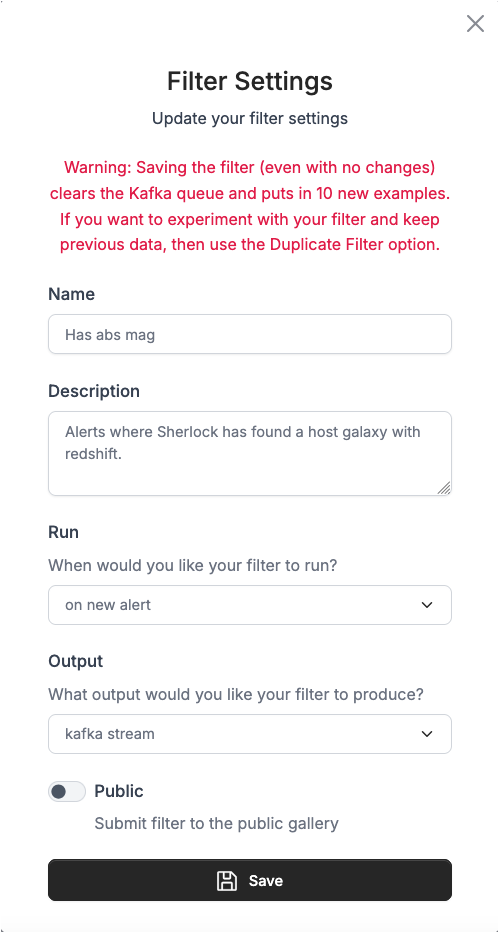
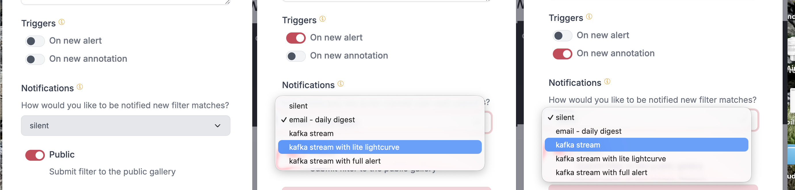
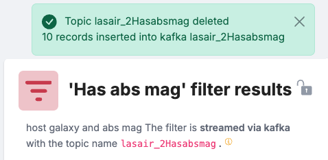
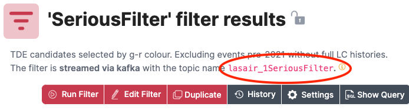

## Alert Streams

The Lasair broker can send immediate “push” notifications when your  
filter sees an interesting alert or, if your filter uses annotations, when the
annotation is updated. Results are delivered using Kafka; alternatively you can
get results as a daily email, although obviously this will only be
suitable for filters that produce limited output

### Resources
- See the [Consume Kafka notebook](https://github.com/lsst-uk/lasair-examples/blob/main/notebooks/consume_kafka.ipynb) for basic consumption of an active stream.
- Copy and modify the [Consume Kafka Plot notebook](https://github.com/lsst-uk/lasair-examples/blob/main/notebooks/consume_kafka_plot.ipynb) to consume a stream with a light curve and plot it.
- Watch the video [Topic and GroupID for a Lasair Kafka Stream](https://youtu.be/HJneKr1EhmY).
- Copy and modify the program at the bottom of this page to fetch your own Kafka records.

### Filter triggering and notification
Lasair provides a protocol for immediate delivery that is suitable for machines to 
communicate with machines. It is called Kafka, and is the way alerts are delivered from
the Rubin Observatory to brokers such as Lasair.
By providing Kafka streams, Lasair provides a machine-readable packet of data 
that can cause action at your site. 

You will need to be logged in to your Lasair account. [Make a filter](make_filter.html),
then click “Save". You will then be prompted for "Filter Settings", 
which you can fill in like this:



You need a name and description.

The next menu indicates the trigger that makes your filter run, which can be 
when you click the "run filter" button on the web page, or if the filter is "active"
it can be triggered by either an alert or an annotation. To keep the filter inactive,
meaning it only runs from clicking, just uncheck both the trigger options.

If you select "On new alert", then your filter is run in near-real-time against arriving alerts.
There is an additional option if your filter involves [annotations](../concepts.html#annotations),
so it can also run when the annotation is updated, either instead of or as well as when
a new alert arrives. If you choose *both* of these options, you will get the results of the
filter *first* when the alert arrives, using the old value of the annotation, then *again*
onece the annotator as run and been uploaded and you get results with the new value
of the annotation.

The _notification_ menu asks what content you would like to appear in your output Kafka stream. See
[below](#types-of-kafka-streams) for details. 

Here are some examples of how the trigger and notification can be set for a filter:


Left: An inactive filter. Only runs when you click "Run Filter" on the web page.

Middle: A filter that produces the SELECTed attributes and the lite lightcurve, 
triggered by the arrival of an alert.

Right: A filter triggered by the arrival of the annotation that the filter is listening for, 
that produces only the SELECTed attributes.

At the bottom choose whether the filter is to be publicly visible or not.

### Kafka Streams
When you save the filter, you see something like this:



The pink warning on the settings panel is connected to the green message in the response. 
Whenever a kafka filter is changed, the old records are deleted, and Lasair runs
the new filter to try and put 10 records in the stream so you can see something
with the Kafka consumer (code below). This is so you can experiment with 
the stream in a cycle of editing and consuming kafka. (Of course if your filter
returns no objects, then none will be put in the kafka stream! Trying to read from such an
empty topic will result in the error `UNKNOWN_TOPIC_OR_PART`; this is not a problem,
the error will go away when the fist message is returned by the filter.)
Once saved, you can run the filter in the usual way 
from the web browser, but you will have to wait for more alerts to arrive for 
more records to go in the stream.

In order to run the consumer code, you need the "topic name" corresponding to your 
filter, which is derived from the name you gave it in the settings. In this case the 
topic name is `lasair_2Hasabsmag`.

### Types of Kafka Streams
The plain Kafka stream offers just the attributes you selected in your filter query.
Supoose your SQL SELECT says `objects.diaObjectId,  objects.decl, objects.ra`, 
then your plain Kafka output would be just these, with a timestamp added for
when the record was produced:
```
{
  "diaObjectId": 169760235333878021,
  "decl": -38.16173726666955,
  "ra": 221.87087177320953,
  "UTC": "2026-01-29 11:40:14",
}
```

If you choose the lite lightcurve option, you also get the basic lightcurve
information from the `alert` record:
```
{
  "diaObjectId": 169760235333878021,
  "decl": -38.16173726666955,
  "ra": 221.87087177320953,
  "UTC": "2026-01-29 11:40:14",
  "alert": {
    "diaSourcesList": [
      {
        "psfFlux": 13677.0458984375,
        "psfFluxErr": 1538.7562255859375,
        "midpointMjdTai": 61029.354114730224,
        "band": "z",
        "reliability": 0.4863438308238983
      },
      ....  (perhaps 100 of these with 5 attributes each)
    ],
    "diaForcedSourcesList": [....]
  }
}
```

If you choose kafka with the full alert, you will get records like this, with the full 
alert data as received from Rubin, except for the cutout images:
```
{
  "diaObjectId": 169760235359568157,
  "decl": -38.15011815002772,
  "ra": 223.6809029068466,
  "UTC": "2026-01-29 11:40:14",
  "alert": {
    "diaObject": {
      "diaObjectId": 169760235359568157,
      "validityStartMjdTai": 61029.3580485083,
      "ra": 223.6809029068466,
      "raErr": 3.365151133039035e-05,
      ....  (78 more attributes)
    },
    "diaSourcesList": [
      {
        "diaSourceId": 169760235359568157,
        "visit": 2025121900283,
        "detector": 179,
        "diaObjectId": 169760235359568157,
        ....  (94 more attributes)
      },
      ....  (perhaps 100 of these packets of 98 attributes each)
    ],
    "diaForcedSourcesList": [ .... ],
  }
}
```

**WARNING The full alert records can be quite large, perhaps a fraction of a megabyte,
and if your filter passes a large number of these they will be dropped.** Lasair cannot
be expected to supply an individual user with **all** the data on **all** the alerts as 
that would be terabytes per night. In any case, Kafka records are deleted after 7 days,
so you will need to be running a consumer either frequently or constantly to get 
everything.

### Kafka consumer code
To run the code below, install
[Confluent Kafka](https://pypi.org/project/confluent-kafka/), 
the python install being `pip install confluent_kafka`.

You will be connecting to `lasair-lsst-kafka.lsst_pub.ac.uk` on port 9092. 

You will need to understand two concepts: `topic_name` and `group_id`. The `topic_name` is a string 
to identify which stream of alerts you want, which derives from the name of a 
Lasair active filter. 
The `group_id` tells Kafka where to start delivery to you. It is just a string 
that you can make up, for example "Susan3456". The Kafka server remembers which 
`group_id`s it has seen before, and which was the last alert it delivered. 
When you start your code again with the same `group_id`, you only get alerts 
that arrived since last time you used that `group_id`. If you use a new `group_id`, 
you get the alerts from the start of the Kafka cache, which is about 7 days.

You can find the topic that corresponds to your filter in the detail page, shown here in the red oval:



The topic name is a combination of the string "lasair_", the ID number of your user account, and
a sanitised version of the name you gave the filter. Therefore if you edit the 
filter and change its name, the topic name will also change.

For testing purposes, the `group_id` will change frequently, and you can get all of the alerts
the come from the given stream in the last 7 days. 
Then you will set up your program to run continuously, perhaps in a `screen` session 
on a server machine, or started every hour by `cron`. 
In this case, the `group_id` should remain constant, so you won't get any alerts twice.

Here is the sample code
```
import json
from lasair import lasair_consumer

kafka_server = 'lasair-lsst-kafka_pub.lsst.ac.uk:9092'
group_id     = 'test123'
my_topic     = 'lasair_2Hasabsmag'
consumer = lasair_consumer(kafka_server, group_id, my_topic)
import json
n = 0
while n < 10:
    msg = consumer.poll(timeout=20)
    if msg is None:
        break
    if msg.error():
        print(str(msg.error()))
        break
    jmsg = json.loads(msg.value())
    print(json.dumps(jmsg, indent=2))
    print('===')
    n += 1
print('No more messages available')
```

### Example notebook

There is a jupyter notebook that shows how to read from an active filter (like the code above), as well as make a plot including the `diaSourceList` and `diaForcedSourceList`.
It assumes the filter has been saved with the 'lite lightcurve' option.

[See consume_kafka_plot.ipynb](https://github.com/lsst-uk/lasair-examples/blob/main/notebooks/consume_kafka_plot.ipynb).

### Email Streaming

The email distribution is a much simpler notification process, and is intended for 
filters that do not pass many alerts. A single daily email will be sent on any day 
when there are results, containing all the results from the filters. If you choose 
the email option, you cannot get lightcurves, only the SELECTed attributes
of the filter.
