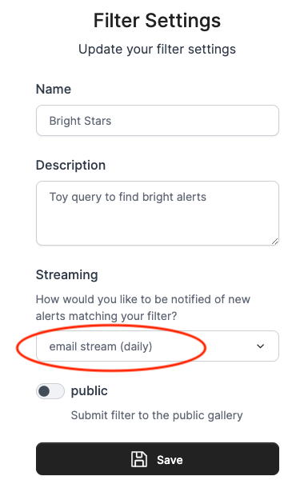

## Alert Streams

The Lasair broker can send immediate “push” notifications when your active 
filter sees and interesting alert. Here is how to make that 
happen with email notification. First make sure you are logged in to your 
Lasair account (top left of screen, then go to create new stored filter. 
This page is about how to get machine-readable push records from your active filter; 
You can also get alert by email, although obviously the numbers will be limited.

### Resources
- See the "Test_Consumers" notebook in the [Lasair API Examples notebooks](https://github.com/lsst-uk/lasair-examples/blob/main/notebooks/Test_Consumers.ipynb)
- Watch the video [Topic and GroupID for a Lasair Kafka Stream](https://youtu.be/HJneKr1EhmY).
- Copy and modify the program at the bottom of this page to fetch your own Kafka records.

### Active Filter with Kafka
Lasair provides a protocol for immediate delivery that is suitable for machines to 
communicate with machines. It is called Kafka, and is the way alerts are delivered from
the Rubin Observatory to brokers such as Lasair.
By providing Kafka streams, Lasair provides a machine-readable packet of data 
that can cause action at your site. 

You will need to be logged in to your Lasair account. Make a filter as in the
previous section, then click “Save". You will then be prompted for "Filter Settings", 
which you can fill in like this:



You need a name and description, and at the bottom choose the filter is to be
publicly visible or not. See below for the meaning of the various choices in
the "Streaming" selection. When you save the filter, you see something like this:


The red warning on the settings panel is connected to the green message in the response. 
Whenever a kafka filter is changed, the old records are deleted, and Lasair runs
the new filter to try and put 10 records in the stream so you can see something
with the Kafka consumer (code below). You can run the filter in the usual way 
from the web browser, but you will have to wait for some alerts to arrive for 
more records to go in the stream.

In order to run the consumer code, you need the "topic name" corresponding to your 
filter, which is derived from the name you gave it in the settings. In this case the 
topic name is `lasair_2Hasabsmag`.

#### Types of Kafka Streams
The plain kafka stream offers just the attributes you selected in your filter query.
Supoose your SQL SELECT says `objects.diaObjectId,  objects.decl, objects.ra`, 
then your plain Kafka output would be just these, with a timestamp added for
when the record was produced:
```
{
  "diaObjectId": 169760235333878021,
  "decl": -38.16173726666955,
  "ra": 221.87087177320953,
  "UTC": "2026-01-29 11:40:14",
}
```

If you choose the lite lightcurve option, you also get the basic lightcurve
information from the `alert` record:
```
{
  "diaObjectId": 169760235333878021,
  "decl": -38.16173726666955,
  "ra": 221.87087177320953,
  "UTC": "2026-01-29 11:40:14",
  "alert": {
    "diaSourcesList": [
      {
        "psfFlux": 13677.0458984375,
        "psfFluxErr": 1538.7562255859375,
        "midpointMjdTai": 61029.354114730224,
        "band": "z",
        "reliability": 0.4863438308238983
      },
      ....  (perhaps 100 of these with 5 attributes each)
    ],
    "diaForcedSourcesList": [....]
  }
}
```

If you choose kafka with the full alert, you will get records like this, with the full 
alert data as received from Rubin, except for the cutout images:
```
{
  "diaObjectId": 169760235359568157,
  "decl": -38.15011815002772,
  "ra": 223.6809029068466,
  "UTC": "2026-01-29 11:40:14",
  "alert": {
    "diaObject": {
      "diaObjectId": 169760235359568157,
      "validityStartMjdTai": 61029.3580485083,
      "ra": 223.6809029068466,
      "raErr": 3.365151133039035e-05,
      ....  (78 more attributes)
    },
    "diaSourcesList": [
      {
        "diaSourceId": 169760235359568157,
        "visit": 2025121900283,
        "detector": 179,
        "diaObjectId": 169760235359568157,
        ....  (94 more attributes)
      },
      ....  (perhaps 100 of these packets of 98 attributes each)
    ],
    "diaForcedSourcesList": [ .... ],
  }
}
```

**WARNING The full alert records can be quite large, perhaps a fraction of a megabyte,
and if your filter passes a large number of these they will be dropped.** Lasair cannot
be expected to supply an individual user with **all** the data on **all** the alerts as 
that would be terabytes per night. In any case, Kafka records are deleted after 7 days,
so you will need to be running a consumer either frequently or constantly to get 
everything.

#### Kafka consumer code
To run the code below, install
[Confluent Kafka](https://pypi.org/project/confluent-kafka/), 
the python install being `pip install confluent_kafka`.

You will be connecting to `lasair-lsst-kafka.lsst.ac.uk` on port 9092. 

You will need to understand two concepts: `topic_name` and `group_id`. The `topic_name` is a string 
to identify which stream of alerts you want, which derives from the name of a 
Lasair active filter. 
The `group_id` tells Kafka where to start delivery to you. It is just a string 
that you can make up, for example "Susan3456". The Kafka server remembers which 
`group_id`s it has seen before, and which was the last alert it delivered. 
When you start your code again with the same `group_id`, you only get alerts 
that arrived since last time you used that `group_id`. If you use a new `group_id`, 
you get the alerts from the start of the Kafka cache, which is about 7 days.

You can find the topic that corresponds to your filter in the detail page, shown here in the red oval:


The topic name is a combination of the string "lasair_", the ID number of your user account, and
a sanitised version of the name you gave the filter. Therefore if you edit the 
filter and change its name, the topic name will also change.

For testing purposes, the `group_id` will change frequently, and you can get all of the alerts
the come from the given stream in the last 7 days. 
Then you will set up your program to run continuously, perhaps in a `screen` session 
on a server machine, or started every hour by `cron`. 
In this case, the `group_id` should remain constant, so you won't get any alerts twice.

Here is the sample code
```
import json
from lasair import lasair_consumer

kafka_server = 'lasair-lsst-kafka.lsst.ac.uk:9092'
group_id     = 'test123'
my_topic     = 'lasair_2Hasabsmag'
consumer = lasair_consumer(kafka_server, group_id, my_topic)
import json
n = 0
while n < 10:
    msg = consumer.poll(timeout=20)
    if msg is None:
        break
    if msg.error():
        print(str(msg.error()))
        break
    jmsg = json.loads(msg.value())
    print(json.dumps(jmsg, indent=2))
    print('===')
    n += 1
print('No more messages available')
```

#### Email Streaming

The email distribution is a much simpler notification process, and is intended for 
filters that do not pass many alerts 
in a given day -- or else the email box will be flooded with spam. Lasair throttles
the number of emails; once the first has been sent, another will not be sent until 24
hours later, containing the objects passed by the filter in that time. In this 
way, a maximum of one email per day can come from a Lasair filter.

