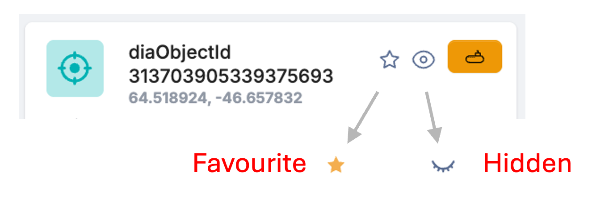

Favourites and Hiding
------------------------
Important Note: The following features are only available to those with a user account. This is free and only requires an email address.

Lasair now has a way to "Favourite" objects. Just go to any object page, and there is a picture of a star and an eye. Clicking on the star makes it change colour to yellow, and puts the object in your favourites list.

So as you look at today's output from your Lasair filter, you can Favourite those that may get follow-up, or any other reason. Also, as you look through your Lasair filter, you see the same objects come up, even though you have already decided you don't want it. You can now click on the eye icon, and it changes to a closed eye: this means the object is "hidden" and you won't see it again without trying.

There is a page especially to show your Favourites. You can use Favourites in filters: the filter-builder page how has extra check boxes for "Only my favourites" and "Include hidden objects".
