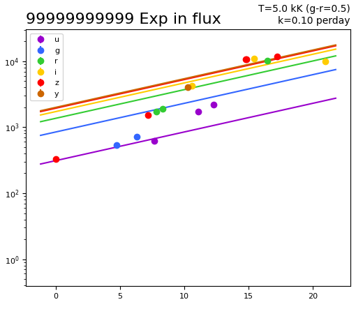
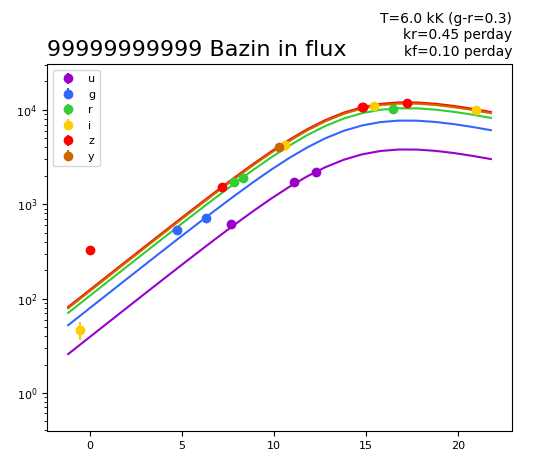
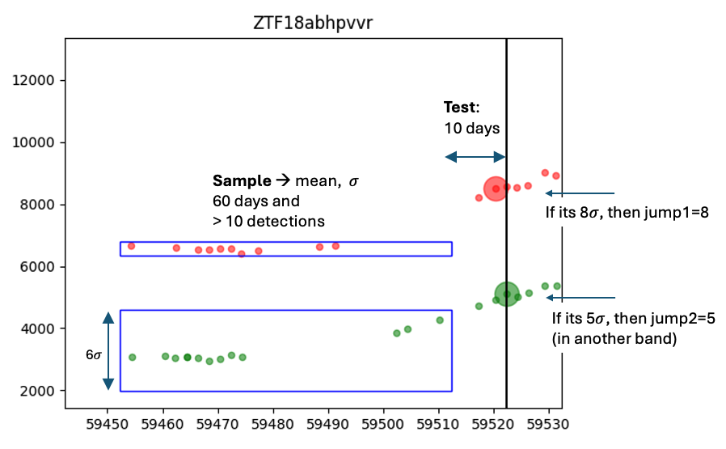
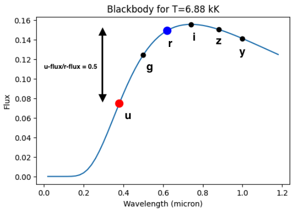

# Lasair's Lightcurve Features

These are lightcurve and contextual features that can be used in Lasair filters.
For more information see [Schema Browser](/schema)

### Object table
- **Basic Information**: diaObjectId, RA and Dec, proper motion.

----
- **Lightcurve interval**: MJD of the first and last diaSource in the lightcurve.

----
- **Latest flux**: For each of the six bands, the latest flux in nJ, 
the date of that detection, and the mean and its standard deviation of that flux.

----
- **Counting**: total number of diaSources in the lightcurve, 
and six counts for the number of sources of each band.

----
- **Nearest objects**: Name from TNS, if any, and nearest LSST object.
This will not be properly populated until after the first LSST data release.

----
- **Absolute magnitude**: peak extincton corrected absolute magnitude, 
and the MJD of that peak. For more information, see 
[Absolute Magnitude](cookbook.html#absolute-magnitude) in the Cookbook.

----
- **Bazin black body**: A two-dimensional fit with blackbody in the 
spectral dimension and either exponential flux rise or Bazin model for flux.
In the example below, the Bazin model has rise rate of 0.45 magnitudes per day, 
and a fall rate of 0.1 per day. The fitted temperature is 6,000 Kelvin.

See the [notebook](https://github.com/lsst-uk/lasair-examples/blob/main/notebooks/features/6_bazinBlackBody.ipynb) for more information.

----
- **Milky way**: Galactic latitude and E(B-V) extinction.

----
- **Jump detector**: Finds the number of sigma the latest detection (time T)
 deviates from a mean in the interval [T-70,T-10] days. 

See the [notebook](https://github.com/lsst-uk/lasair-examples/blob/main/notebooks/features/3_jumpFromMean.ipynb) for more information.

----
- **Pair colours**: The LSST survey cadence has many close pairs of diaSources
only 30 minutes apart. Each of these allows a colour measurement to be made.
Lasair allows filters on the basic properties: magnitude difference and 
which filters were involved, for example g-r=0.5. But there are many 
possible pairs -- u+g, u+r, g+r, r+i,  i+z,  z+y at least -- so Lasair
also computes an effective temperature. In the figure, suppose there is a 
flux ratio of 0.5 in a u+r pair; then by fitting a blackbody spectrum
we can get an effective temperature of 6,880 Kelvin.

For more information see the [notebook](https://github.com/lsst-uk/lasair-examples/blob/main/notebooks/features/5_pair.ipynb).

### Sherlock table
Intelligent crossmatch from multiple catalogues.
For more information see the [notebook](https://github.com/lsst-uk/lasair-examples/blob/main/notebooks/features/2_sherlock.ipynb), or
[Sherlock writeup](core_functions/sherlock.html).

### TNS table
Lasair keeps an up-to-date clone of the TNS database of ~100,000 supernovae, 
FRBs and other transient phenomena. See 
[Schema Browser](/schema), and the [TNS website](https://www.wis-tns.org/).

### Extended Object Table
The extended object attributes are all those copied from the LSST `diaObject` that Lasair feels might not be important,
but includes them anyway for users who know what they mean.
