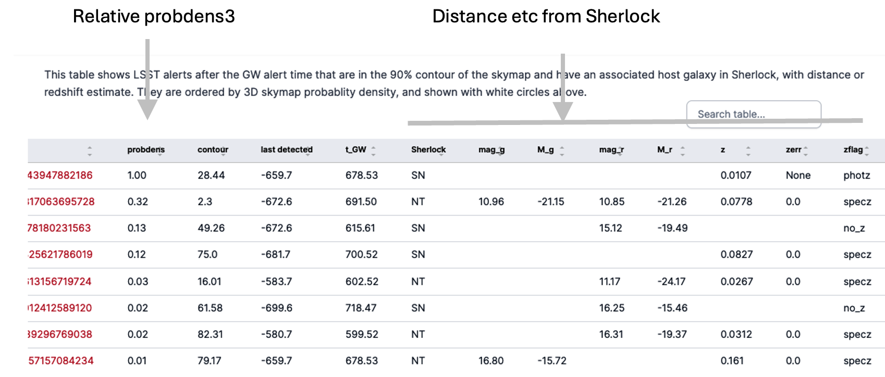

# Multimessenger Counterparts

Lasair can be used to find optical counterparts of gravitational-wave or 
gamma-ray events. In particular, Lasair expects its multimessenger alerts to 
have a probability distribution on the sky, known as a "skymap".
Skymaps are often represented by a HEALPIX FITS file, and that is what Lasair expects.
From that, it computes MOC (watchmap) files for the 10, 50, and 90 
percentiles of the skymap.

There can be different types of multimessenger events -- gravitational wave (namespace LVK) 
and Fermi gamma-ray alerts (namespace "GBM").

## LVK: Gravitational Waves

There was great excitement for the GW170817 kilonova, a NS-NS merger.
When it happens again, it must be found quickly – we want the explosion not the embers!
Light is not expected from a binary black hole (BBH), so we
restrict attention to binary neutron star (BNS) and neutron-star-black-hole (NSBH) mergers.

For gravitational waves, namespace is `LVK` (LIGO-Virgo-Kagra), for example `LVK:GW150914`.
This picture shows the three MOCs on the sky, together with some possible 
optical counterparts.

Lasair will have limits of processing skymaps. Each requires considerable 
computational work, and often has multiple versions. Lasair can choose **only**
BNS or NSBH alerts, and the skymap 90-percentile-area must be sufficiently small.

From the skymap, we generate `probdens2`, the probability density on the sky.
By sorting in reverse order of this, we can list the most likely counterparts first:

But LVK also provides a Gaussian distance estimate and error for each pixel. 
Therefore if an optical counterpart has a distance estimate, further screening can be done, rejecting those in the wrong distance regime. We generate `probdens3` for this 
three-dimensional probability density. In order to estimate distance, we consider
only those optical alerts with a host galaxy, whose distance is known. 
Lasair gets this information through Sherlock.
Once this distance information is there, Lasair also provides an estimate of 
absolute magnitude (supernova ~-19 but kilonova -10 to -15), giving an extra filter
on the alert stream.
The table of 3d matches looks like this:

Perhaps the best strategy is to follow up the 3D matches first, 
and only then start on the 2D matches.

## GBM: Fermi GBM bursts
To find optical counterparts of gamma-ray bursts detected by Fermi.

