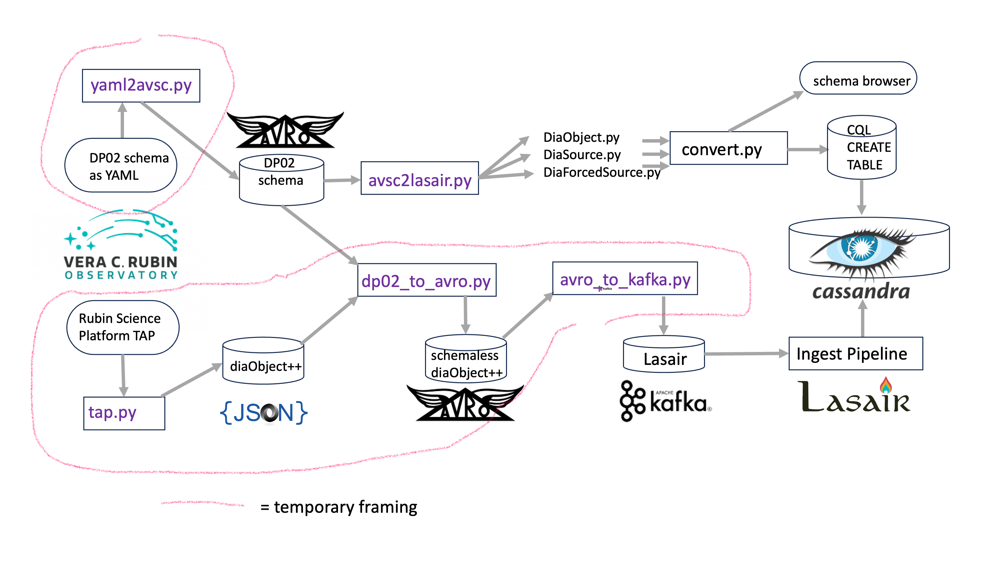

### Fetching DP02 for Lasair

The [DP0.2 data release](https://dp0-2.lsst.io/) consists of a schema and the data. 
When LSST is running the schema will be available as AVRO schema, and the alerts as AVRO packets. Everything outlined in pink above is temporary framing to allow the YAML achema and RSP data access to substitute for these.

The schema is expressed for humans [here](https://dm.lsst.org/sdm_schemas/browser/dp02.html) and for machines as a [YAML file](https://github.com/lsst/sdm_schemas/blob/main/yml/dp02_dc2.yaml). In the picture above, (top left) the program `yaml2avro.py` converts the YAML to an AVRO schema. This can be converted by the program `avsc2lasair.py` to the schema files that Lasair can use to create Cassandra tables and feed the schema browser on the web pages. Lower left, the data can be pulled from the RSP, but this is slow -- other options are being explored. The result is each `diaObject`, with its list of `diaSources` and `forcedSourceOnDiaObjects` is saved as a JSON file. The program `dp02_to_avro.py` takes the schema and the data and uses them to build a (schemaless) AVRO file for each object. because the schema is not onboard the AVRO file, it is critical that the same schema is available to the reader of the file. Finally the program `avro_to_kafka.py` puts the data into Lasair's kafka system, from which it can be ingested to Cassandra and down the pipeline.

### First the schema
```
cd ~/lasair-lsst/utility/DP02
```
Now convert DC02 schema to what Lasair needs
```
curl -o dp02_dc2.yaml "https://raw.githubusercontent.com/lsst/sdm_schemas/main/yml/dp02_dc2.yaml"
```

Convert the YAML to an AVRO schema
```
python3 yaml2avsc.py < dp02_dc2.yaml > ../../common/schema/dp02.avsc.orig
```
```
cd ../../common/schema
cp dp02.avsc.orig dp02.avsc
```

Modify the dp02.avsc to change psfFlux/psfFluxErr to psFlux/psFluxErr in the forcedSourceOnDiaObjects, and add the `filterName` attribute.

Modifications to ForcedSourceOnDiaObjects to align with DiaSources:
- new attribute `midPointTai` copied from `CcdVisit.expMidptMJD`

Make the files that Lasair needs for its databases (SQL and CQL), as well as for the schema browser
```
python3 avsc2lasair.py dp02.avsc
cp lsst_schema/DiaObjects.py               lasair_schema/diaObjects.py
cp lsst_schema/DiaSources.py               lasair_schema/diaSources.py
cp lsst_schema/ForcedSourceOnDiaObjects.py lasair_schema/forcedSourceOnDiaObjects.py
```

Now edit `lasair_schema/*.py` to add primary key to "indexes" -- examples [here](https://github.com/lsst-uk/lasair-lsst/tree/main/common/schema/lasair_schema)

Now convert these modified schema to the database CREATE TABLE
```
cp ../../../common/schema/convert.py .
python3 convert.py cql diaObjects
python3 convert.py cql diaSources
python3 convert.py cql forcedSourceOnDiaObjects
```

Can now use the CQL to make Cassandra tables and the SQL to make Galera tables

### Get data RSP --> Lasair Kafka
Get some data via TAP interface (slow). First put your RSP token in `settings.py` as
```
cd ..
mkdir data
```
Make a file `settings.py` with your RSP token like this `RSP_TOKEN = 'gt-ZhwzwDmLzxxxxxxxxxxxxxxxxxxxxxxxxx7TJMl_gw'`

Now make a JSON file for each object and for its diaSources and forcedSourceOnDiaObjects. First argument is how many objects, next is minimum number of sources per object
```
python3 tap.py <howMany> <howManySources>
```

Turn it into schemaless avro packets. This directory is for howMany=5 and howManySources=10
```
python3 json_to_avro.py  data_0005_10
```

Push it into Lasair Kafka ready for ingestion, with topic `DP02`
```
python3 avro_to_kafka.py data_0005_10
```


